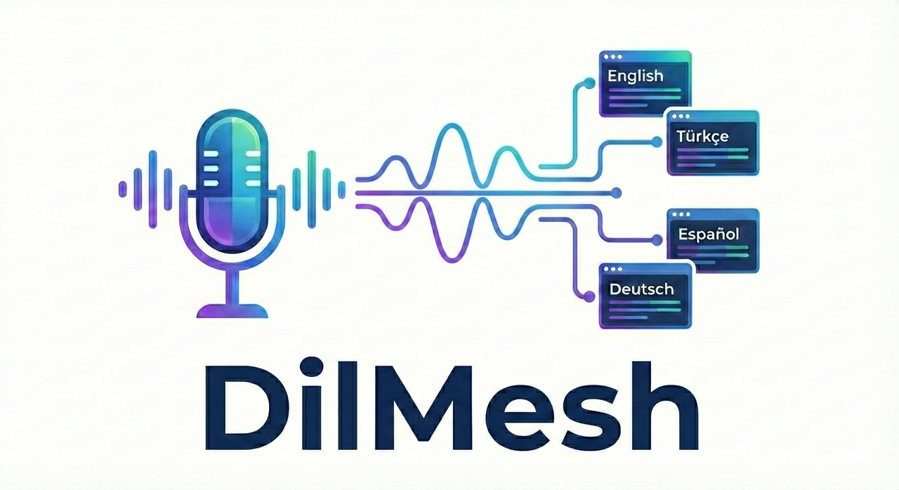
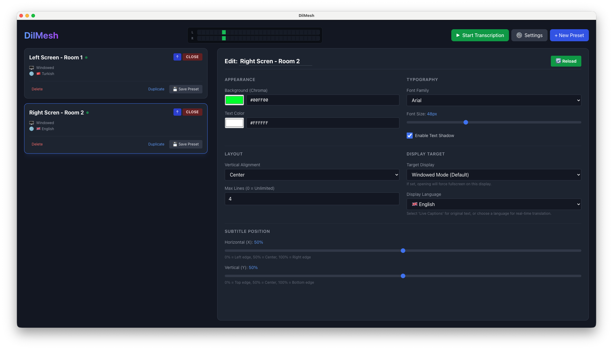
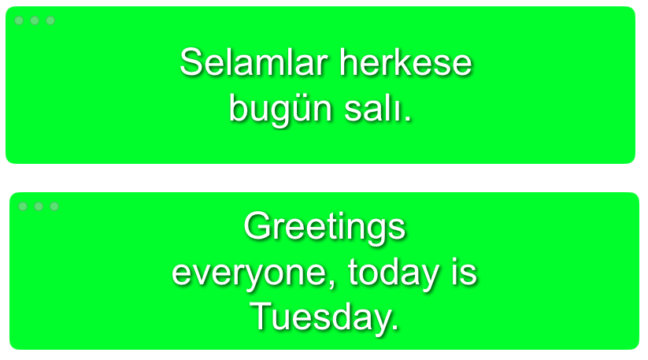

<!-- Header Image Placeholder -->
<div align="center">
   
  <!-- If you don't have an image yet, this will just show the alt text or broken image icon. Replaced once you add the file. -->
</div>

# DilMesh 🎙️🌐

> **Live Instant Subtitles & Real-time Multi-language Translation**

DilMesh is a powerful desktop application that provides real-time speech-to-text and instant translation, capable of broadcasting subtitles to multiple windows simultaneously. It's designed for streamers, presenters, and anyone needing accessible, multilingual communication on the fly.

[](https://opensource.org/licenses/MIT)
[](https://www.electronjs.org/)
[](https://vuejs.org/)
[](https://www.typescriptlang.org/)


## ✨ Key Features

- **🎙️ Real-time Speech-to-Text**: High-accuracy transcription using **Google Cloud Speech-to-Text** or **OpenAI Whisper (Local)**.
- **🌐 Instant Multi-language Translation**: Translate spoken audio into multiple languages simultaneously (e.g., English -> Turkish, Spanish, French) in real-time.
- **🖥️ Multi-Window Broadcasting**: Create separate, customizable subtitle windows for different displays or OBS scenes. Each window can display a different language!
- **🎨 Highly Customizable**: 
  - Adjust font size, color, background (chroma key), and positioning.
  - **Analog VU Meter**: Visual audio feedback with peak indicators.
- **🔄 System Tray Integration**: Minimized to tray for unobtrusive operation.
- **🚀 Performance Optimized**: Built with Electron + Vite + Vue 3 for a snappy experience.
- **🔜 Future API Support**: We are actively working on adding more speech-to-text and translation providers (e.g., DeepL, Azure, AWS, and more). Stay tuned!

## � Screenshots

### 🎛️ Dashboard
_Control all your settings, transcription status, and active windows from a single place._
<div align="center">
  
  <!-- Place your dashboard screenshot as 'dashboard.png' in the root directory -->
</div>

### 🔲 Multi-Window & Fullscreen Projection
_Broadcast subtitles to multiple windows or project them fullscreen on specific displays. Each output can have different languages, styles, and positioning._
<div align="center">
  
  <!-- Place your windows screenshot as 'windows.png' in the root directory -->
</div>

## 🚀 Installation

### Prerequisites

- **Node.js** (v18 or higher recommended)
- **Node.js** (v18 or higher recommended)
- **pnpm** (This project uses pnpm for package management)
- **Google Cloud Platform Account** (Optional, for higher accuracy and translation features)

### Setup

1.  **Clone the repository:**
    ```bash
    git clone https://github.com/antlionguard/dilmesh.git
    cd dilmesh
    ```

2.  **Install dependencies:**
    ```bash
    pnpm install
    ```

3.  **Run in Development Mode:**
    ```bash
    pnpm dev
    ```

## 📦 Build

To create a distributable application for your OS:

- **macOS (DMG/App):**
  ```bash
  pnpm build:mac
  ```

- **Windows (NSIS/Portable):**
  ```bash
  pnpm build:win
  ```

## ⚙️ Configuration

### Google Cloud (Recommended for Best Experience)

1.  Create a project in [Google Cloud Console](https://console.cloud.google.com/).
2.  Enable **Cloud Speech-to-Text API** and **Cloud Translation API**.
3.  Create a Service Account and download the **JSON Key File**.
4.  In DilMesh, go to **Settings** -> **Transcription Provider** -> **Google Cloud Platform**.
5.  Paste the contents of your JSON key file.

### Local Whisper (Free, Offline)

1.  Go to **Settings**.
2.  Select **Local Whisper**.
3.  Choose a model size (`tiny`, `base`, `small`). *Note: Requires downloading the model on first use.*

## 🤝 Contributing

We love contributions! Whether it's fixing bugs, adding new languages, or implementing new features from our roadmap. Please feel free to submit a Pull Request.

1.  Fork the Project
2.  Create your Feature Branch (`git checkout -b feature/AmazingFeature`)
3.  Commit your Changes (`git commit -m 'Add some AmazingFeature'`)
4.  Push to the Branch (`git push origin feature/AmazingFeature`)
5.  Open a Pull Request

## 📄 License

Distributed under the MIT License. See `LICENSE` for more information.

## ❤️ Support

If you find this project useful, you can support its development!

<a href="https://www.buymeacoffee.com/antlionguards" target="_blank">
  
</a>
