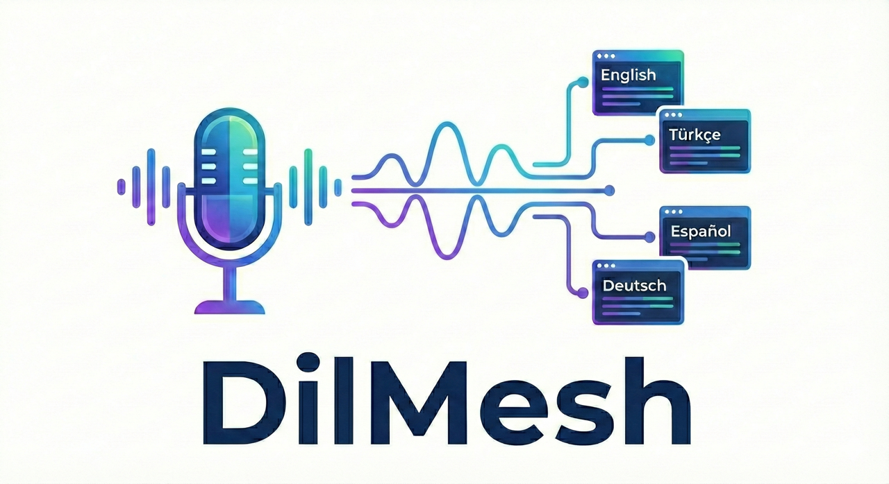
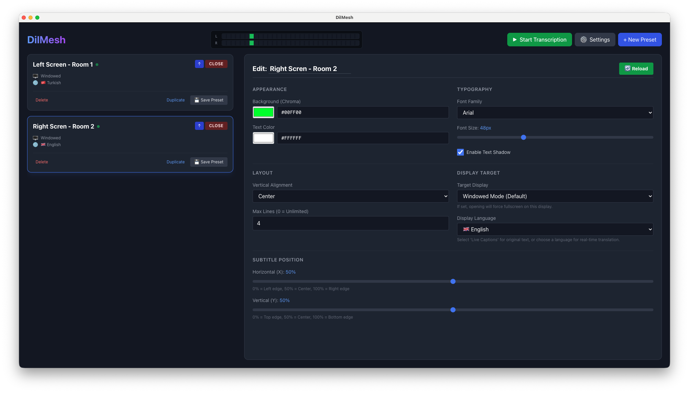
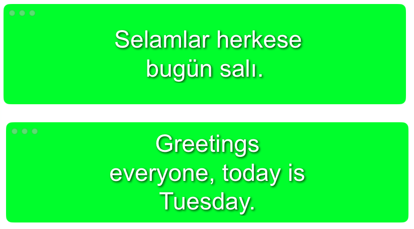

<!-- Header Image Placeholder -->
<div align="center">
  
</div>

# DilMesh 🎙️🌐

> **Live Instant Subtitles & Real-time Multi-language Translation**

DilMesh is a powerful desktop application that provides real-time speech-to-text and instant translation, capable of broadcasting subtitles to multiple windows simultaneously. It's designed for streamers, presenters, conference organizers, and anyone needing accessible, multilingual communication on the fly.

[](https://opensource.org/licenses/MIT)
[](https://github.com/antlionguard/dilmesh/releases)
[](https://www.electronjs.org/)
[](https://vuejs.org/)
[](https://www.typescriptlang.org/)


## ✨ Key Features

### 🎙️ Speech-to-Text Providers
Choose from **5 built-in STT providers** — switch between them live from Settings:

| Provider | Type | Description |
|---|---|---|
| **Google Cloud (GCP)** | ☁️ Cloud | Industry-leading accuracy. 60 min free/month. Supports interim results, auto-punctuation, enhanced models, confidence threshold, and profanity filtering. |
| **Deepgram** | ☁️ Cloud | Ultra-low latency with Nova-3 model. Built-in multi-language auto-detection, speaker diarization, smart formatting, filler word removal, and keyword boosting. |
| **NVIDIA Riva** | ⚡ GPU Server | Self-hosted GPU inference via gRPC. For organizations with on-premise AI infrastructure. |
| **Sherpa-ONNX** | 🗣️ Offline | Fully offline ASR. Includes Omnilingual 1B model (1600+ languages), English Zipformer, Chinese/English bilingual, and Chinese Paraformer models. |
| **Local Whisper** | 🎧 Offline | OpenAI Whisper running locally via HuggingFace Transformers. Supports Tiny, Base, Small, Medium, Large v3 Turbo, and quantized variants. No internet required. |

### 🌐 Translation Providers
Translate subtitles into any target language in real time:

| Provider | Type | Description |
|---|---|---|
| **Google Cloud Translation** | ☁️ Cloud | V2 Basic API — 500K characters free/month. |
| **NLLB-200** | 🧠 Offline | Meta's 200-language model, ONNX quantized (~800MB). Runs 100% offline after download. |
| **Riva NMT** | ⚡ GPU Server | Neural machine translation on self-hosted Riva server. |
| **Disabled** | 🚫 — | Use DilMesh as a captions-only display without translation. |

### 🖥️ Multi-Window Broadcasting with Language Layers
- Open **multiple independent subtitle windows** simultaneously — one per audience group, language, or OBS scene.
- Each window is configured via a **Preset** and supports multiple **Language Layers**:
  - **Live Layer**: Shows raw real-time captions as they are transcribed (no translation delay).
  - **Translation Layer**: Receives finalized sentences, runs them through the translation pipeline, and displays them with CPS (Characters Per Second) pacing.
- Each layer has independent per-layer controls:
  - Language selection (30+ languages)
  - Font family, font size, text color
  - X/Y position (percentage-based, fully flexible)
  - Max lines limit
  - **Max width** (in px) — enables side-by-side multi-language layouts on a single screen
  - Text shadow toggle

### 🎛️ Preset System
- Create, edit, duplicate, and delete **named presets** for different subtitle configurations.
- Each preset stores its own language layers, background/chroma key color, vertical alignment, and display target.
- Presets are **persisted on disk** and survive app restarts.
- Live-editing: save a preset and instantly push the changes to the open window without restarting.

### 📺 Fullscreen Display Targeting
- Detect all connected monitors automatically.
- Assign a preset to a specific display — opening it will **fullscreen on that display** instantly.
- Windowed mode is also supported for flexible layouts.

### 🧠 Voice Activity Detection (Silero VAD)
- Integrated **Silero VAD** runs locally, only forwarding audio to the STT provider when speech is detected.
- Saves API costs, reduces noise, and improves transcription quality.
- Configurable **sensitivity threshold** and **minimum silence duration** sliders.

### ⚡ Real-time Translation Pipeline
- Subtitle sentences are detected via **punctuation-based clause detection** — no waiting for silence.
- Configurable sentence-split characters (`.`, `!`, `?`, `…`, `,`, `;`, `:`).
- Detected clauses are sent for translation immediately, giving near-zero perceptible delay.
- **CPS Queue Player**: displays translated subtitles at a configurable reading speed (default: 17 CPS — Netflix standard). Queue depth is also configurable.

### 🔊 Deepgram — Parallel Language Streams
- When using Deepgram with multiple recognition languages selected, DilMesh opens **one parallel WebSocket stream per language**.
- Best result across all streams is selected per utterance based on confidence scores and dominant language bias.
- Supports `is_final` and `speech_final` events for accurate sentence boundaries.

### 🚫 Profanity Filter
- Available for both **GCP** and **Deepgram** providers.
- Masked words are fully removed from captions — not passed to translation APIs.

### 📊 Analog VU Meter
- Real-time audio level visualization with peak indicators, displayed in the dashboard header.
- Automatically uses the configured microphone device.

### 🔧 Microphone Selection
- Enumerate all available audio input devices.
- Select any specific microphone from the Settings panel.

### 🔄 System Tray Integration
- Minimize DilMesh to the system tray — subtitle windows and transcription continue running in the background.
- Click the tray icon to show/hide the dashboard.

---

## 📦 Supported Languages

### Recognition (STT)
50+ languages supported across providers, including English (US/UK/AU), Turkish, German, French, Spanish, Italian, Portuguese, Russian, Arabic, Japanese, Korean, Chinese, Hindi, and many more. Deepgram also supports **Multi (auto-detect)** mode.

### Translation (Target)
30+ languages available for subtitle translation layers, grouped by region: Western Europe, Eastern Europe, Nordic, Baltic, Asia, Middle East, Africa. Includes Chinese Simplified, Traditional, and Cantonese variants.

---

## 🖼️ Screenshots

### 🎛️ Dashboard
_Control presets, transcription, and open/close windows from a single place._
<div align="center">
  
</div>

### 🔲 Multi-Window & Fullscreen Projection
_Broadcast subtitles to multiple windows or project them fullscreen on a specific display._
<div align="center">
  
</div>

---

## 🚀 Installation

### Prerequisites

- **Node.js** v18 or higher
- **pnpm** (this project uses pnpm for package management)
- A supported STT provider API key (Google Cloud, Deepgram, etc.) — or use offline providers with no key needed.

### Setup

1. **Clone the repository:**
   ```bash
   git clone https://github.com/antlionguard/dilmesh.git
   cd dilmesh
   ```

2. **Install dependencies:**
   ```bash
   pnpm install
   ```

3. **Run in Development Mode:**
   ```bash
   pnpm dev
   ```

## 📦 Build

To create a distributable application for your OS:

- **macOS (DMG/App):**
  ```bash
  pnpm build:mac
  ```

- **Windows (NSIS/Portable):**
  ```bash
  pnpm build:win
  ```

- **Both platforms:**
  ```bash
  pnpm build:all
  ```

---

## ⚙️ Configuration

### Google Cloud (GCP)

1. Create a project in [Google Cloud Console](https://console.cloud.google.com/).
2. Enable **Cloud Speech-to-Text API** and **Cloud Translation API**.
3. Create a Service Account and download the **JSON Key File**.
4. In DilMesh, go to **Settings → API Integrations → Google Cloud**.
5. Paste the contents of your JSON key file.

> **Free Tier:** Speech-to-Text is free for the first 60 min/month (Standard model). Translation V2 is free for the first 500K characters/month.

### Deepgram

1. Sign up at [console.deepgram.com](https://console.deepgram.com) — you get **$200 free credit** on signup.
2. Create an API key.
3. In DilMesh, go to **Settings → API Integrations → Deepgram** and paste your key.
4. Configure the model (Nova-3 recommended), language, and options in **Settings → Speech-to-Text**.

### Local Whisper (Offline)

1. Go to **Settings → Speech-to-Text → Whisper**.
2. Download a model (Tiny to Large). Recommended: `Large V3 Turbo Q8` (~834MB) for best accuracy/speed balance.
3. Select the downloaded model and start transcription.

### Sherpa-ONNX (Offline)

1. Go to **Settings → Speech-to-Text → Sherpa-ONNX**.
2. Download a model (e.g., Omnilingual 1B for 1600+ language support, or language-specific models).
3. Select the downloaded model as active.

### NLLB-200 Offline Translation

1. Go to **Settings → Translation → NLLB-200**.
2. Click **Download** (~800MB, one time).
3. After download, NLLB is used automatically for all translation layers when selected.

### NVIDIA Riva

1. Set up a [Riva Server](https://docs.nvidia.com/deeplearning/riva/user-guide/docs/quick-start-guide.html) (requires an NVIDIA GPU on the server side).
2. In DilMesh, go to **Settings → API Integrations → NVIDIA Riva**.
3. Enter your server URL (e.g., `localhost:50051`) and SSL settings if needed.

---

## 🗺️ How It Works

```
Microphone → Silero VAD → Active STT Provider
                                   ↓
                         Punctuation Detector
                         (real-time clause detection)
                                   ↓
              ┌────────────────────┴──────────────────────┐
              ↓                                           ↓
    Live Caption Layers                    Translation Layers
    (instant, no delay)                 (clause → Translation API)
              ↓                                           ↓
       Projection Window                         CPS Queue Player
       (per-layer display)                     (timed display pacing)
```

Each projection window can have any number of language layers stacked on top of each other or placed side-by-side, all fed from the same single audio input.

---

## 🤝 Contributing

We love contributions! Whether it's fixing bugs, adding new languages, implementing new STT/translation providers, or improving the UI.

1. Fork the Project
2. Create your Feature Branch (`git checkout -b feature/AmazingFeature`)
3. Commit your Changes (`git commit -m 'Add some AmazingFeature'`)
4. Push to the Branch (`git push origin feature/AmazingFeature`)
5. Open a Pull Request

---

## 📄 License

Distributed under the MIT License. See `LICENSE` for more information.

---

## ❤️ Support

If you find this project useful, you can support its development!

<a href="https://www.buymeacoffee.com/antlionguards" target="_blank">
  
</a>
